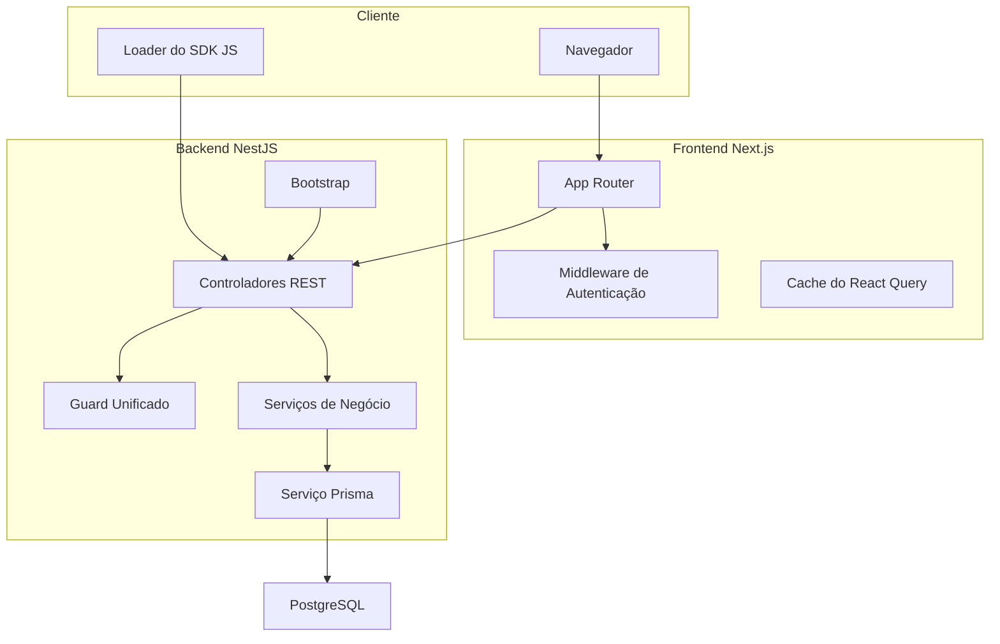
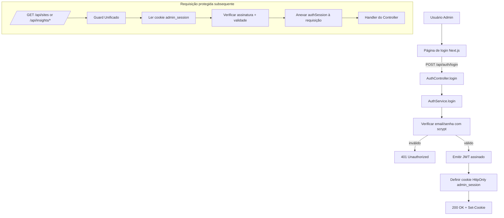
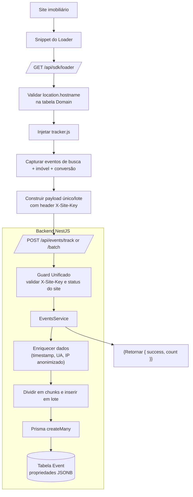
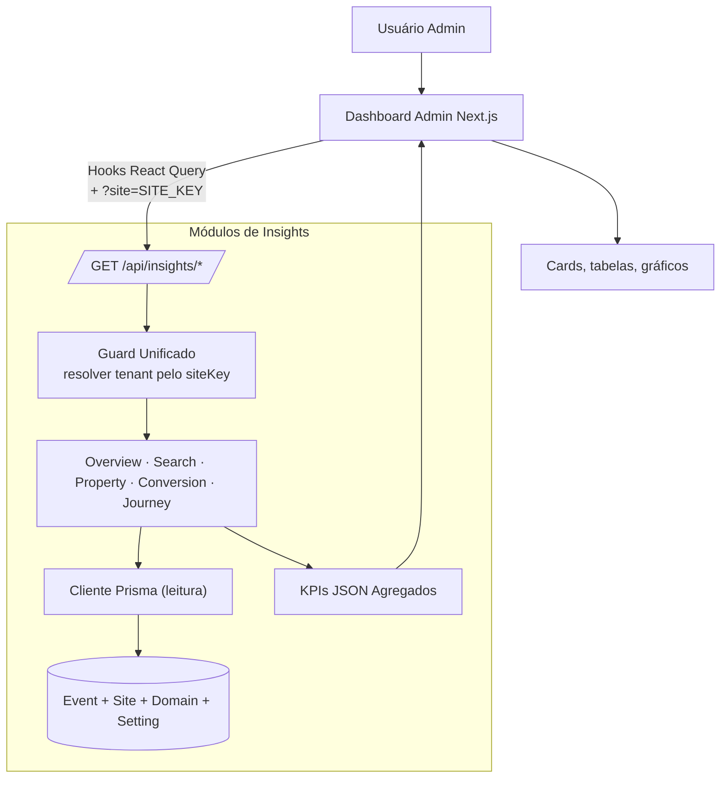
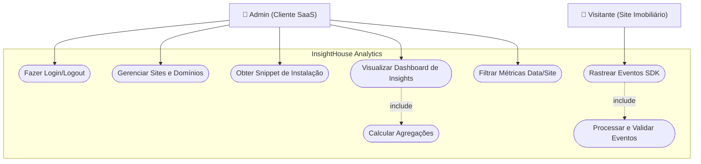

# Especificações do Sistema — InsightHouse Analytics

Este documento detalha o projeto lógico, os fluxos principais, o diagrama arquitetural, os requisitos funcionais e não funcionais, as dependências técnicas e os procedimentos de desenvolvimento local da plataforma InsightHouse.

## 1. Arquitetura Lógica

- Camadas e responsabilidades
  - Entrada e Configuração
    - `back/src/main.ts`: Bootstrap, middlewares globais, Swagger/OpenAPI.
    - `back/src/app.module.ts`: Módulo raiz que orquestra os módulos de negócio.
  - Segurança
    - Guard unificado valida autenticação (cookie JWT `admin_session`) e tenant (`X-Site-Key` ou `?site=`).
  - Módulos de negócio
    - `auth`: autenticação baseada em sessão e gerenciamento de usuários.
    - `sites`: gestão de sites e domínios (multi‑tenancy).
    - `events`: ingestão de eventos de analytics em alta taxa (único/lote).
    - `insights`: consultas de analytics (overview/search/property/conversion/journey).
    - `categories`: utilitário de categorização de eventos.
    - `sdk`: entrega do loader JavaScript e configurações por site.
    - `health`: verificações de saúde do app e do banco.
  - Persistência
    - `PrismaService` é cliente de banco singleton (PostgreSQL) com hooks de ciclo de vida e logging.
  - Frontend
    - Next.js 15 (App Router), React 19, Tailwind, Radix UI, TanStack Query.
    - Middleware valida o cookie de sessão em rotas protegidas.

## 2. Fluxos Principais

### 2.1 Autenticação (cookie de sessão)

- Backend
  - `AuthService.login`: valida email/senha (scrypt), atualiza `lastLoginAt`, assina JWT, define cookie HttpOnly.
  - Guard unificado lê o cookie `admin_session`, verifica o JWT e anexa `authSession` ao request quando válido.
- Frontend
  - `front/src/middleware.ts`: bloqueia rotas protegidas quando o cookie está ausente/inválido e redireciona para `/login`.

Comportamento esperado
- Em login bem-sucedido, um cookie JWT assinado é retornado e usado nas requisições protegidas subsequentes.
- Endpoints protegidos retornam 401 se o cookie estiver ausente/inválido.

### 2.2 Ingestão de eventos (validação de tenant)

- SDK do cliente envia eventos para `/api/events/track` ou `/api/events/track/batch` com `X-Site-Key`.
- Guard resolve o site pelo `siteKey` e exige `status = 'active'`.
- Serviço de eventos enriquece dados server‑side (timestamp, UA, IP anonimizado) e insere em lotes.

Comportamento esperado
- `X-Site-Key` ausente/inválida resulta em 400/403; site inativo resulta em 403.
- Ingestão em lote retorna `{ success: true, count }`.

### 2.3 Consultas de insights

- Frontend chama `/api/insights/*?site=KEY`.
- Guard valida o tenant e anexa `tenant` ao request.
- Serviços executam agregações SQL/JSONB e retornam JSON tipado.

Comportamento esperado
- `site` ausente → 400; inválido → 403.
- Respostas são numérica‑seguras (conversões BigInt → Number tratadas).

### 2.4 Sites e domínios (multi‑tenancy)

- Admin cria sites e domínios permitidos.
- `siteKey` é identificador único referenciado pelo SDK e pelas consultas.
- Endpoints de CRUD exigem sessão admin válida; domínios são únicos por site.

### 2.5 Instalação do Rastreador

- Admin acessa `/admin/install`.
- Sistema gera snippet HTML com `siteKey` do primeiro site ativo.
- Usuário copia e cola o snippet no `<head>` do site alvo.
- Script carrega assincronamente e inicia coleta automática.

## 3. Módulos, Serviços e Contratos

- Auth
  - Endpoints: `POST /auth/register`, `POST /auth/login`, `POST /auth/logout`, `GET /auth/me`.
  - Validação de DTO via `class-validator`; cookies são HttpOnly.
- Sites
  - Endpoints: list/create/get/update/delete; valida FQDN; gera `siteKey` único.
- SDK
  - Endpoints: `GET /sdk/loader?site=...`, `GET /sdk/site-config?site=...`.
- Events
  - Endpoints: `POST /events/track`, `POST /events/track/batch` (com `X-Site-Key`).
- Insights
  - Endpoints: devices, search analytics, filters usage, conversion (rate/sources), properties (popular/engagement), journey metrics.
  - Módulos internos: `Overview`, `Search`, `Property`, `Conversion`, `Journey`.
- Categories
  - Utilitário compartilhado para classificar eventos em `SEARCH`, `NAVIGATION`, `CONVERSION`, `PROPERTY`.
- Health
  - Endpoints: `/health`, `/health/db`.

Guards e Decorators
- Guard unificado: valida cookie de sessão e/ou site key conforme metadados da rota.
- Decorators: `@CurrentUser()`, `@SiteKey()` projetam dados do contexto do request.

## 4. Diagrama Arquitetural (Alto Nível)

## 5. Modelo de Domínio (Visão Prisma)

- `User`
  - Campos: `id`, `email`, `name?`, `passwordHash?`, `plan`, `avatarUrl?`, `twoFactorEnabled`, `notificationsEnabled`, `createdAt`, `updatedAt`, `lastLoginAt?`
  - Relações: `sites`
  - Índices: `@@index([email])`
- `Site`
  - Campos: `id`, `userId`, `name`, `siteKey (unique)`, `status`, `createdAt`, `updatedAt`
  - Relações: `user`, `domains`, `settings`
  - Índices: `@@index([userId])`, `@@index([siteKey])`, `@@index([userId, status])`
- `Domain`
  - Campos: `id`, `siteId`, `host`, `isPrimary`, timestamps
  - Único: `@@unique([siteId, host])`
  - Índices: `@@index([host])`, `@@index([siteId])`
- `Setting`
  - Campos: `id`, `siteId`, `key`, `value`, timestamps
  - Único: `@@unique([siteId, key])`
- `Event`
  - Tabela de alto volume; colunas JSONB para propriedades flexíveis; indexada para agregações frequentes.

## 6. Especificação de API (Resumo)

Todos os endpoints do backend são prefixados por `/api`. Swagger UI disponível em `/api/docs`.

- Autenticação
  - `POST /api/auth/register`: Registra usuário. Body: `{ email, password, name? }`. Retorna usuário ou info de sessão.
  - `POST /api/auth/login`: Login. Body: `{ email, password }`. Retorna cookie de sessão HttpOnly.
  - `POST /api/auth/logout`: Logout. Limpa o cookie da sessão.
  - `GET /api/auth/me`: Retorna o usuário atual. Requer cookie de sessão.

- Sites
  - `GET /api/sites`
  - `POST /api/sites`
  - `GET /api/sites/:id`
  - `PUT /api/sites/:id`
  - `DELETE /api/sites/:id`
  - Requer cookie de sessão; valida domínios e unicidade.

- SDK
  - `GET /api/sdk/loader?site=<siteKey>`: Retorna o script loader.
  - `GET /api/sdk/site-config?site=<siteKey>`: Retorna a configuração do site.

- Events
  - `POST /api/events/track`: Evento único. Headers: `X-Site-Key`. Body: payload do evento.
  - `POST /api/events/track/batch`: Ingestão em lote. Headers: `X-Site-Key`. Body: `{ events: [...] }`.

- Insights
  - Devices: `GET /api/insights/devices`, `GET /api/insights/devices/timeseries`
  - Search: `GET /api/insights/search/analytics`
  - Filters: `GET /api/insights/filters/usage`
  - Conversion: `GET /api/insights/conversion/rate`, `GET /api/insights/conversion/sources`
  - Properties: `GET /api/insights/properties/popular`, `GET /api/insights/properties/engagement`
  - Todos exigem resolução de tenant via header ou `?site=`.

- Health
  - `GET /api/health`, `GET /api/health/db`

Tratamento de erros
- 400: erros de validação (DTOs/parâmetros)
- 401: cookie de sessão ausente/inválido quando exigido
/- 403: tenant inválido/desabilitado (`X-Site-Key`)
- 429: limitação por rate limiter

## 7. Requisitos Funcionais

- Autenticação de usuário com cookies de sessão (HttpOnly, payload JWT assinado)
- CRUD de sites e domínios permitidos
- Ingestão de eventos (único/lote) com separação por tenant
- Endpoints de insights para devices, buscas, filtros, conversões e propriedades
- Loader do SDK e endpoints de configuração por site
- Health checks (aplicação e banco)

## 8. Requisitos Não Funcionais

- Segurança
  - Sessão baseada em cookie (HttpOnly), hashing de senha via scrypt
  - Cabeçalhos de segurança (Helmet), CORS, guard unificado para auth + tenant
  - Validação de DTO (`class-validator` + `ValidationPipe` com whitelist/transform)
- Performance
  - Rate limiting (Throttler)
  - Inserts em lote (chunked), cache em memória para insights
  - Consultas indexadas e padrões de agregação com JSONB
- Confiabilidade
  - Hooks de ciclo de vida do Prisma, desligamento gracioso
  - Endpoints de saúde para readiness
- Observabilidade
  - Interceptor global de logging (request/response com duração)

## 9. Dependências Técnicas

- Backend
  - NestJS 11 (`@nestjs/common/core/platform-express/jwt/swagger/throttler`)
  - Prisma 5.17 (`@prisma/client`, `prisma`)
  - PostgreSQL (15+)
  - Validação: `class-validator`, `class-transformer`
  - Segurança: `helmet`, `cookie-parser`
  - Ferramentas: `@nestjs/cli`, `eslint`, `prettier`, `jest`

- Frontend
  - Next.js 15.1.8, React 19, TypeScript 5
  - TanStack Query 5, Radix UI, Tailwind CSS 3
  - Utilitários: `clsx`, `date-fns`, `zod`

- Gerenciador de pacotes
  - pnpm (workspaces), lockfiles em `front/` e `back/`

## 10. Ambiente e Configuração

- Backend
  - `DATABASE_URL`, `DIRECT_URL`, `PORT=3001`, `NODE_ENV`
  - `FRONTEND_URL` (CORS), `NEXTAUTH_SECRET` (HMAC), `API_BASE_URL`
- Frontend
  - `SITE_URL`, `NEXTAUTH_SECRET`

## 13. Diagramas de Fluxo (Mermaid)

### 13.1 Fluxo de Autenticação (Sessão com Cookie)

### 13.2 Fluxo de Ingestão de Eventos (SDK → Backend)

### 13.3 Fluxo de Consultas de Insights

### 13.4 Fluxo de Instalação do Rastreador

```mermaid
flowchart LR
  AdminUser[Usuário Admin] --> AdminInstall[/Rota Next.js /admin/install/]
  AdminInstall --> LoadSites[Carregar sites ativos do usuário]
  LoadSites --> SelectSite[Selecionar primeiro site ativo ou site escolhido]
  SelectSite --> GenerateSnippet[Gerar snippet do loader\ncom siteKey e origem do app]
  GenerateSnippet --> ShowSnippet[Renderizar snippet e instruções]

  ShowSnippet --> CopyPaste[Admin copia snippet para o <head> do site cliente]
  CopyPaste --> ClientTraffic[Usuários finais visitam site imobiliário]
  ClientTraffic --> LoaderExec[Loader executa e inicia coleta de dados]
```

### 13.5 Diagrama de Caso de Uso

## 14. Riscos e Evoluções Futuras

- Migrar caches em memória para Redis visando escalabilidade horizontal
- Introduzir filas (Bull/BullMQ) para ingestão/agragações offline
- Particionar a tabela `Event` e introduzir réplicas de leitura para analytics pesados
- Servir o SDK via CDN e habilitar cache com ETag
- Canais WebSocket para dashboards quase em tempo real

## 15. Referências (Context7)

- Next.js: `/vercel/next.js`
- NestJS: `/nestjs/docs.nestjs.com`, `/nestjs/nest`
- Prisma: `/prisma/docs`, `/prisma/prisma`
- TanStack Query: `/websites/tanstack_query_v5`
- Tailwind CSS: `/tailwindlabs/tailwindcss.com`

