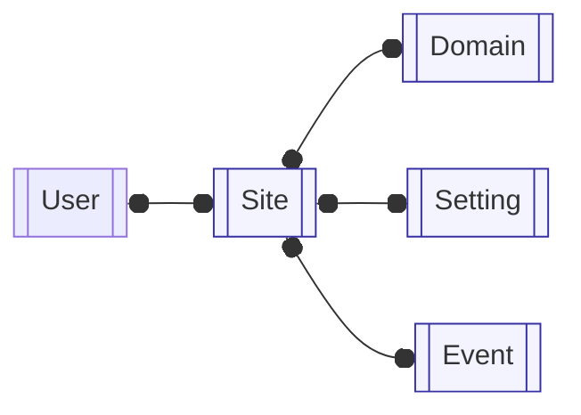

# InsightHouse Analytics

Plataforma full‑stack de analytics web multi‑tenant construída com Next.js (App Router) e NestJS. Suporta acesso administrativo baseado em sessão, ingestão de eventos via SDK JavaScript e insights sobre PostgreSQL (Prisma ORM) com agregações SQL/JSONB.

## Estrutura do Monorepo

```
projeto-tfc/
├─ back/                  # NestJS 11, Prisma, PostgreSQL, Swagger
│  ├─ src/
│  │  ├─ auth/           # Autenticação (login/register/me/logout)
│  │  ├─ sites/          # Sites e domínios (multi‑tenancy)
│  │  ├─ events/         # Ingestão de eventos (lote/único)
│  │  ├─ insights/       # Módulos de analytics (overview/search/property/conversion/journey)
│  │  │  └─ categories/  # Classificação de tipos de eventos
│  │  ├─ sdk/            # Loader do SDK JS e configuração por site
│  │  ├─ health/         # Health checks
│  │  ├─ prisma/         # Serviço do Prisma (ciclo de vida da conexão)
│  │  ├─ common/         # guards, interceptors, decorators, utils
│  │  ├─ app.module.ts   # Módulo raiz
│  │  └─ main.ts         # Bootstrap + middlewares globais + Swagger
│  ├─ prisma/            # schema.prisma + migrações
│  └─ package.json
└─ front/                 # Next.js 15.1 (React 19), Tailwind, Radix UI, TanStack Query
   ├─ src/
   │  ├─ app/            # App Router (RSC + componentes client)
   │  ├─ lib/            # Cliente de API, hooks, tipos, providers, componentes
   │  └─ middleware.ts   # Auth: valida cookie de sessão em rotas protegidas
   └─ package.json
```

## Como Funciona (Arquitetura Lógica)

- Backend (NestJS)
  - Middlewares globais: Helmet, CORS, Compression, Cookie Parser, ValidationPipe, Throttler
  - Camada de segurança: guard unificado valida o cookie de sessão JWT (`admin_session`) e o tenant via `X-Site-Key`
  - Módulos de negócio: `auth`, `sites`, `events`, `insights` (com sub-módulos), `sdk`, `health`
  - Persistência: Prisma client (PostgreSQL), migrações em `back/prisma/migrations`
  - Documentação: Swagger UI em `/api/docs`

- Frontend (Next.js)
  - App Router com RSC por padrão; componentes client para interatividade
  - Middleware de auth valida o cookie de sessão antes de rotas protegidas
  - Busca/cache de dados via hooks do TanStack Query
  - Tailwind CSS + Radix UI para o design system

## Fluxos Principais

- Autenticação
  - Backend valida credenciais (hash de senha com scrypt) e emite JWT armazenado em cookie HttpOnly (`admin_session`).
  - Middleware do frontend bloqueia rotas protegidas quando o cookie estiver ausente/inválido.

- Rastreamento de Eventos
  - SDK envia eventos para `/api/events/track` ou `/batch` com header `X-Site-Key`.
  - Guard resolve o tenant (site) e exige status ativo; o serviço enriquece e insere em lotes.

- Insights
  - Next.js chama `/api/insights/*?site=KEY`, o guard valida o tenant e os serviços executam agregações SQL/JSONB otimizadas.

- Multi‑tenancy
  - Admin cria sites e domínios permitidos. Todas as requisições de analytics validam contra `siteKey` (header ou query param).

## Diagrama de Arquitetura (Alto Nível)

```mermaid
flowchart TB
  subgraph client[Client]
    Browser
    SDK[JS SDK Loader]
  end
  subgraph frontend[Frontend Next.js]
    AppRouter[App Router (RSC + Client)]
    Middleware[Auth Middleware]
    Query[React Query Cache]
  end
  subgraph backend[Backend NestJS]
    Main[Bootstrap main.ts]
    AppModule[AppModule]
    Middlewares[Global Middlewares]
    Guards[Unified Guard (JWT + X-Site-Key)]
    Controllers[HTTP Controllers]
    Services[Domain Services\nAuth · Sites · Events · Insights · SDK · Health]
    Prisma[PrismaService (PostgreSQL)]
  end
  DB[(PostgreSQL)]

  Browser --> SDK
  Browser --> AppRouter
  AppRouter --> Middleware
  AppRouter --> Controllers
  SDK --> Controllers
  Controllers --> Guards
  Controllers --> Services
  Services --> Prisma --> DB
  Main --> AppModule --> Middlewares --> Controllers
```

## Diagramas de Fluxo (End‑to‑End)

### Fluxo de Autenticação (Login e Sessão)

```mermaid
flowchart TD
  U[Admin User] -->|email/password| FE_Login[Next.js /login page]
  FE_Login -->|POST /api/auth/login| BE_Login[AuthController.login]
  BE_Login --> AuthService[AuthService]
  AuthService -->|validate with scrypt| DB_Users[(User table)]
  AuthService -->|issue JWT| Cookie[admin_session HttpOnly cookie]
  Cookie --> BE_Response[HTTP 200 + Set-Cookie]
  BE_Response --> FE_Browser[Browser stores cookie]
  FE_Browser --> MW[Next.js auth middleware]
  MW -->|subsequent requests| ProtectedRoutes[/Admin routes (App Router)/]
```

### Fluxo de Ingestão de Eventos

```mermaid
flowchart TD
  subgraph ClientSite[Real Estate Website]
    Script[Injected loader snippet] --> SDK_Client[Capture script\n(capture-filtros.js)]
    SDK_Client --> EventsJSON[Events payload (search/interaction)]
  end

  EventsJSON -->|X-Site-Key header| BE_Track[/POST /api/events/track or /batch/]

  subgraph Backend[NestJS backend]
    BE_Track --> Guard[Unified Guard\nvalidate X-Site-Key + site status]
    Guard --> EventsService[EventsService\n(enrich + batch insert)]
    EventsService --> PrismaEvents[Prisma Client]
    PrismaEvents --> EventsTable[(Event table\nJSONB properties)]
  end
```

### Fluxo de Consultas de Insights

```mermaid
flowchart TD
  Admin[Admin User] --> FE_Dashboard[Next.js Admin Dashboard]
  FE_Dashboard -->|React Query hooks\nGET /api/insights/*?site=KEY| BE_Insights[InsightsController]
  BE_Insights --> Guard_Tenant[Unified Guard\nresolve tenant from siteKey]
  Guard_Tenant --> InsightsService[Insights services\nOverview · Search · Property · Conversion · Journey]
  InsightsService --> Prisma_Read[Prisma Client (read)]
  Prisma_Read --> DB_Events[(Event + Site + Domain)]
  InsightsService --> JSON_KPIs[Aggregated JSON KPIs]
  JSON_KPIs --> FE_Dashboard
  FE_Dashboard --> Charts[Cards, charts and tables]
```

### Visão de Multi‑Tenancy (Domínio de Dados)



## Superfície da API (Principais Endpoints)

- Auth
  - POST `/api/auth/register`
  - POST `/api/auth/login`
  - POST `/api/auth/logout`
  - GET `/api/auth/me`

- Sites
  - GET `/api/sites`
  - POST `/api/sites`
  - GET `/api/sites/:id`
  - PUT `/api/sites/:id`
  - DELETE `/api/sites/:id`

- SDK
  - GET `/api/sdk/loader?site=<siteKey>`
  - GET `/api/sdk/site-config?site=<siteKey>`

- Events
  - POST `/api/events/track`
  - POST `/api/events/track/batch`

- Insights
  - GET `/api/insights/devices`
  - GET `/api/insights/devices/timeseries`
  - GET `/api/insights/search/analytics`
  - GET `/api/insights/filters/usage`
  - GET `/api/insights/conversion/rate`
  - GET `/api/insights/conversion/sources`
  - GET `/api/insights/properties/popular`
  - GET `/api/insights/properties/engagement`

- Health
  - GET `/api/health`
  - GET `/api/health/db`

Observações
- Endpoints protegidos exigem cookie de sessão válido (`admin_session`).
- Endpoints de event/insight exigem tenant válido via header `X-Site-Key` ou `?site=`.

## Banco de Dados (Prisma)

- Modelos: `User`, `Site`, `Domain`, `Setting`, `Event` (alto volume; campos JSONB).
- Índices para consultas frequentes (site, período, tipo, etc.).
- Migrações em `back/prisma/migrations`.

## Requisitos

- Node.js 20+ (imagem Docker do backend usa Node 22), pnpm 9+
- PostgreSQL 15+
- Portas: backend 3001, frontend 3002

## Desenvolvimento Local

1) Backend

```bash
cd back
pnpm install
cp .env.example .env
pnpm prisma migrate dev
pnpm prisma generate
pnpm start:dev
```

2) Frontend

```bash
cd front
pnpm install
cp .env.example .env # se existir
pnpm dev
```

Variáveis de ambiente comuns

- Backend
  - `DATABASE_URL` (obrigatória)
  - `DIRECT_URL` (exigida para migrações do Prisma)
  - `PORT` (padrão 3001)
  - `NODE_ENV` (development | production)
  - `FRONTEND_URL` (origem autorizada no CORS)
  - `NEXTAUTH_SECRET` (segredo HMAC para assinar o cookie de sessão)
  - `API_BASE_URL`

- Frontend
  - `SITE_URL` (URL base pública, usada em fetches)
  - `NEXTAUTH_SECRET` (deve coincidir com o backend se a validação local for necessária no middleware)

## Testes

- Backend: Jest configurado (`pnpm test`, `pnpm test:watch`, `pnpm test:cov`).
- Frontend: adicionar testes conforme a stack preferida (React Testing Library, Vitest/Jest).

## Segurança e Performance (Destaques)

- Cookie JWT HttpOnly para sessão admin, validado pelo guard unificado.
- Isolamento de tenant via `X-Site-Key`; apenas sites ativos processam eventos.
- Validação de entrada via `class-validator` + `ValidationPipe` (whitelist + transform).
- Limitação de taxa e cabeçalhos de segurança via Throttler + Helmet.
- Cache em memória para insights; inserts em lote e chunking para eventos.

## Referências (Docs)

- Next.js: `/vercel/next.js` (Context7)
- NestJS: `/nestjs/docs.nestjs.com` e `/nestjs/nest` (Context7)
- Prisma: `/prisma/docs` e `/prisma/prisma` (Context7)
- TanStack Query: `/websites/tanstack_query_v5` (Context7)
- Tailwind CSS: `/tailwindlabs/tailwindcss.com` (Context7)

