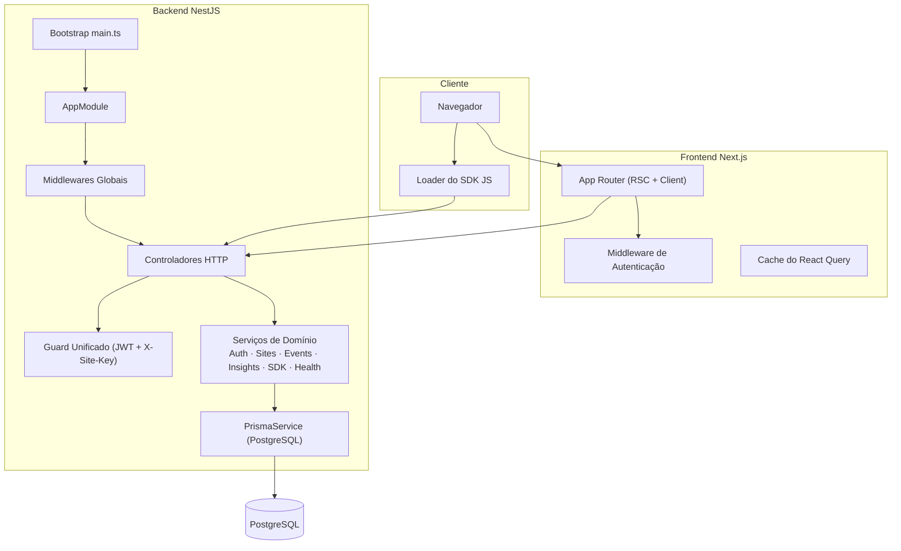
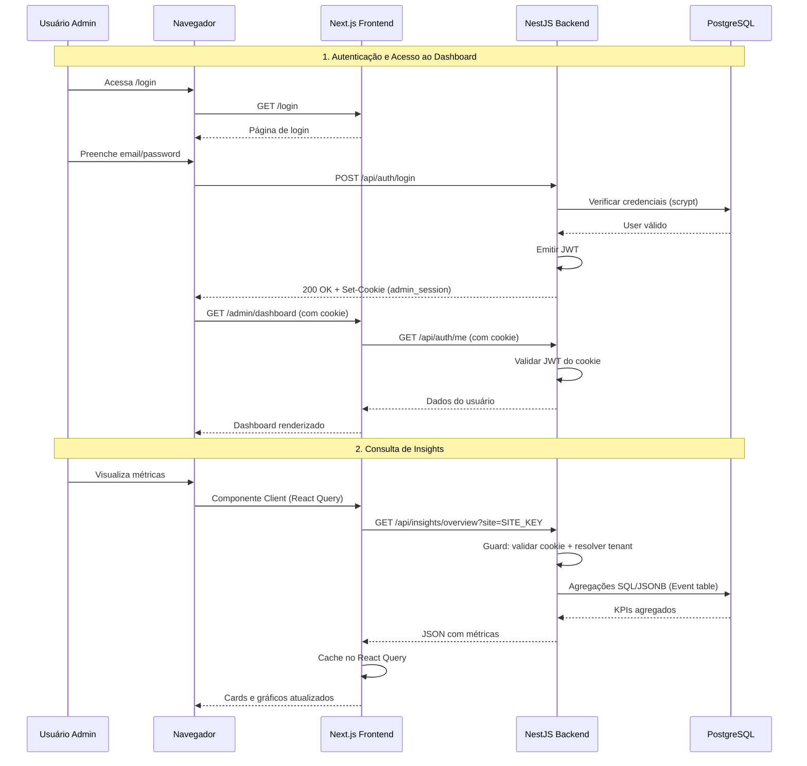
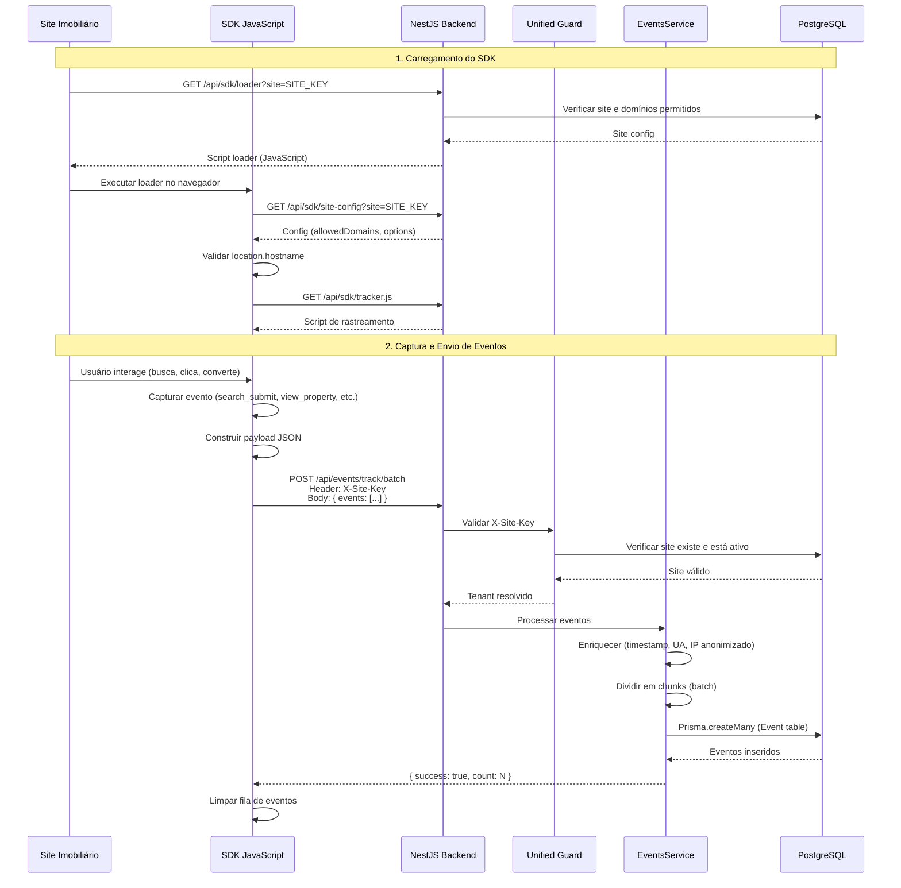
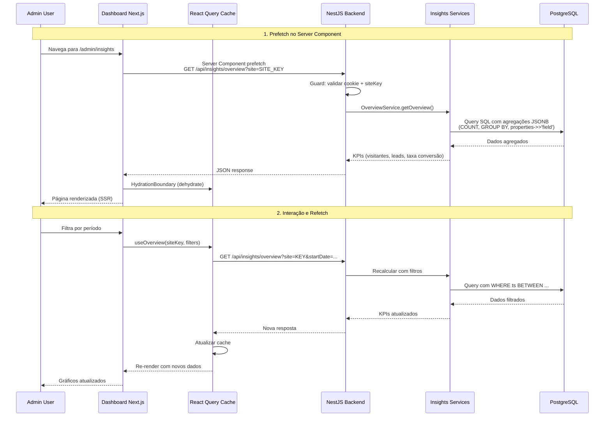
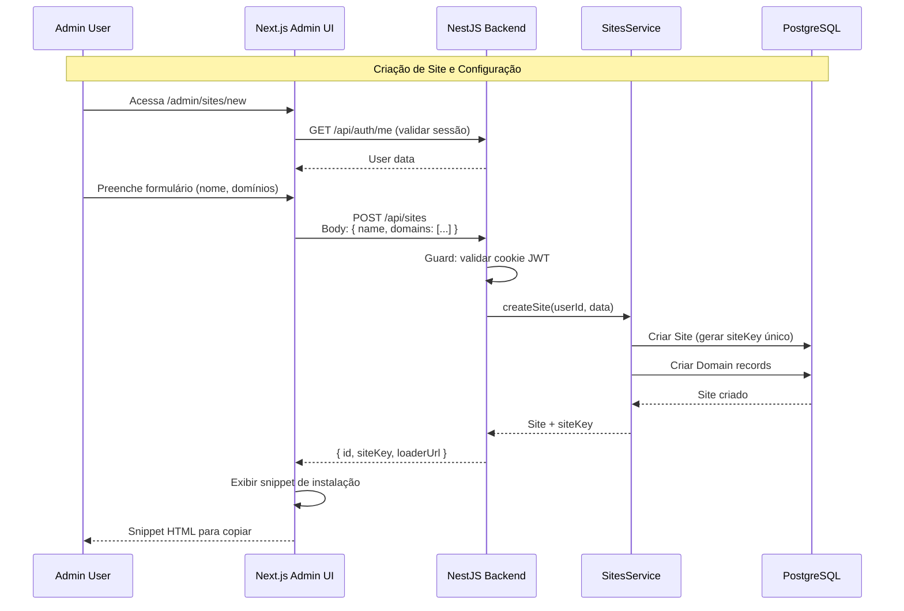

# InsightHouse Analytics

Plataforma full‑stack de analytics web multi‑tenant construída com Next.js (App Router) e NestJS. Suporta acesso administrativo baseado em sessão, ingestão de eventos via SDK JavaScript e insights sobre PostgreSQL (Prisma ORM) com agregações SQL/JSONB.

## Estrutura do Monorepo

```
projeto-tfc/
├─ back/                  # NestJS 11, Prisma, PostgreSQL, Swagger
│  ├─ src/
│  │  ├─ auth/           # Autenticação (login/register/me/logout)
│  │  ├─ sites/          # Sites e domínios (multi‑tenancy)
│  │  ├─ events/         # Ingestão de eventos (lote/único)
│  │  ├─ insights/       # Módulos de analytics (overview/search/property/conversion/journey)
│  │  │  └─ categories/  # Classificação de tipos de eventos
│  │  ├─ sdk/            # Loader do SDK JS e configuração por site
│  │  ├─ health/         # Health checks
│  │  ├─ prisma/         # Serviço do Prisma (ciclo de vida da conexão)
│  │  ├─ common/         # guards, interceptors, decorators, utils
│  │  ├─ app.module.ts   # Módulo raiz
│  │  └─ main.ts         # Bootstrap + middlewares globais + Swagger
│  ├─ prisma/            # schema.prisma + migrações
│  └─ package.json
└─ front/                 # Next.js 15.1 (React 19), Tailwind, Radix UI, TanStack Query
   ├─ src/
   │  ├─ app/            # App Router (RSC + componentes client)
   │  ├─ lib/            # Cliente de API, hooks, tipos, providers, componentes
   │  └─ middleware.ts   # Auth: valida cookie de sessão em rotas protegidas
   └─ package.json
```

## Como Funciona (Arquitetura Lógica)

- Backend (NestJS)
  - Middlewares globais: Helmet, CORS, Compression, Cookie Parser, ValidationPipe, Throttler
  - Camada de segurança: guard unificado valida o cookie de sessão JWT (`admin_session`) e o tenant via `X-Site-Key`
  - Módulos de negócio: `auth`, `sites`, `events`, `insights` (com sub-módulos), `sdk`, `health`
  - Persistência: Prisma client (PostgreSQL), migrações em `back/prisma/migrations`
  - Documentação: Swagger UI em `/api/docs`

- Frontend (Next.js)
  - App Router com RSC por padrão; componentes client para interatividade
  - Middleware de auth valida o cookie de sessão antes de rotas protegidas
  - Busca/cache de dados via hooks do TanStack Query
  - Tailwind CSS + Radix UI para o design system

## Fluxos e Detalhes Técnicos

Para documentação detalhada sobre fluxos de autenticação, ingestão de eventos, especificações da API, modelo de banco de dados e requisitos, consulte o arquivo **[ESPECIFICACOES.md](./ESPECIFICACOES.md)**.

## Diagrama de Arquitetura (Alto Nível)



## Diagramas de Sequência (Fluxos Principais)

### Fluxo Completo do Sistema (Visão Geral)



### Fluxo de Ingestão de Eventos (SDK → Backend)



### Fluxo de Consulta de Insights (Dashboard → Analytics)



### Fluxo de Multi-Tenancy (Criação de Site)




## Desenvolvimento Local

### Pré-requisitos
- Node.js 20+ (imagem Docker do backend usa Node 22), pnpm 9+
- PostgreSQL 15+

1) Backend

```bash
cd back
pnpm install
cp .env.example .env
pnpm prisma migrate dev
pnpm prisma generate
pnpm start:dev
```

2) Frontend

```bash
cd front
pnpm install
cp .env.example .env # se existir
pnpm dev
```

Variáveis de ambiente comuns

- Backend
  - `DATABASE_URL` (obrigatória)
  - `DIRECT_URL` (exigida para migrações do Prisma)
  - `PORT` (padrão 3001)
  - `NODE_ENV` (development | production)
  - `FRONTEND_URL` (origem autorizada no CORS)
  - `NEXTAUTH_SECRET` (segredo HMAC para assinar o cookie de sessão)
  - `API_BASE_URL`

- Frontend
  - `SITE_URL` (URL base pública, usada em fetches)
  - `NEXTAUTH_SECRET` (deve coincidir com o backend se a validação local for necessária no middleware)

## Testes

- Backend: Jest configurado (`pnpm test`, `pnpm test:watch`, `pnpm test:cov`).
- Frontend: adicionar testes conforme a stack preferida (React Testing Library, Vitest/Jest).


## Referências (Docs)

- Next.js: `/vercel/next.js` (Context7)
- NestJS: `/nestjs/docs.nestjs.com` e `/nestjs/nest` (Context7)
- Prisma: `/prisma/docs` e `/prisma/prisma` (Context7)
- TanStack Query: `/websites/tanstack_query_v5` (Context7)
- Tailwind CSS: `/tailwindlabs/tailwindcss.com` (Context7)

