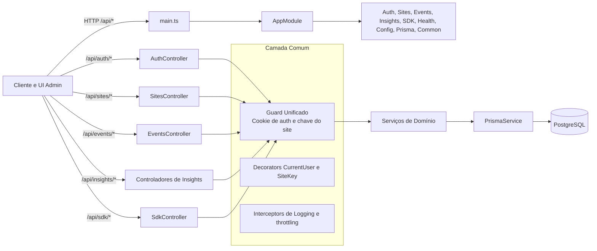
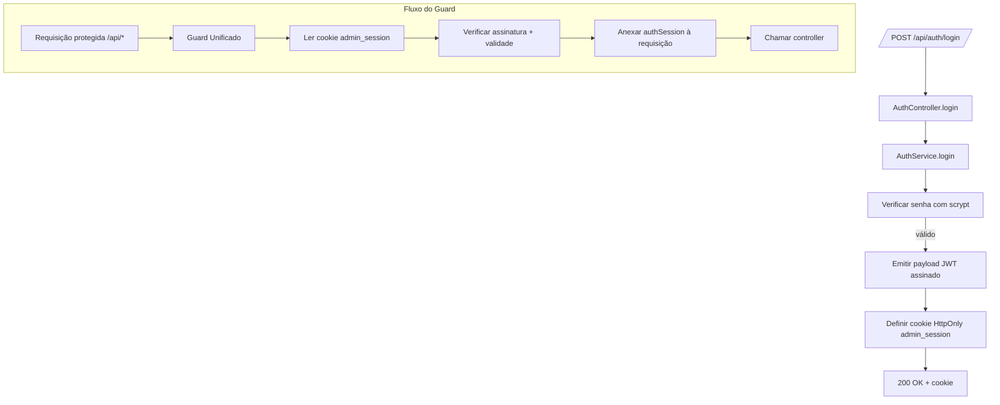

# Backend InsightHouse - API NestJS

Backend de análise e rastreamento de eventos construído com NestJS, TypeScript, Prisma e PostgreSQL.

## Recursos

- 🔐 **Autenticação**: Autenticação baseada em sessão com hash seguro de senhas.
- 🏢 **Multi-Tenancy**: Suporte a múltiplos sites com validação de domínio.
- 📊 **Rastreamento de Eventos**: Ingestão de eventos de alta performance com suporte a lotes (batch).
- 🎯 **Analytics**: Insights em tempo real e análise de comportamento do usuário através de queries SQL.
- 🔒 **Segurança**: CORS, Helmet, limitação de taxa (rate limiting).
- 📝 **Validação**: Validação automática de requisições com `class-validator`.
- 🚀 **Performance**: Consultas otimizadas ao banco de dados e pronto para cache.

## Tecnologias

- **Framework**: NestJS 11+
- **Linguagem**: TypeScript 5+
- **Banco de Dados**: PostgreSQL com Prisma ORM
- **Validação**: class-validator + class-transformer
- **Segurança**: Helmet, CORS, Throttler
- **Gerenciador de Pacotes**: pnpm

## Como Começar

### Pré-requisitos

- Node.js 18+
- pnpm 9+
- PostgreSQL 15+ (ou Docker)

### Instalação

1.  **Iniciar o PostgreSQL** (na raiz do projeto):
    ```bash
    # Voltar para a raiz do projeto
    cd ..

    # Iniciar o Docker Compose
    docker-compose up -d

    # Verificar se os contêineres estão rodando
    docker-compose ps
    ```

2.  **Instalar dependências** (voltar para a pasta `/back`):
    ```bash
    cd back
    pnpm install
    ```

3.  **Configurar variáveis de ambiente**:
    ```bash
    cp .env.example .env
    ```
    O arquivo `.env.example` já vem configurado para o ambiente Docker local.

    **Importante:** Gere um `NEXTAUTH_SECRET` seguro:
    ```bash
    # Windows (PowerShell)
    [Convert]::ToBase64String((1..32 | ForEach-Object { Get-Random -Minimum 0 -Maximum 256 }))

    # Linux/Mac
    openssl rand -base64 32
    ```

4.  **Rodar as migrações do banco de dados**:
    ```bash
    pnpm prisma migrate dev
    pnpm prisma generate
    ```

5.  **Iniciar o servidor de desenvolvimento**:
    ```bash
    pnpm run start:dev
    ```


## Estrutura do Projeto

```
back/
├── prisma/
│   ├── schema.prisma          # Schema do banco de dados
│   └── migrations/            # Migrações do banco
├── src/
│   ├── auth/                  # Módulo de autenticação
│   ├── sites/                 # Módulo de gerenciamento de sites
│   ├── sdk/                   # Módulo do loader do SDK
│   ├── events/                # Módulo de rastreamento de eventos
│   ├── insights/              # Módulo de analytics
│   ├── health/                # Módulo de health check
│   ├── prisma/                # Serviço do Prisma
│   ├── config/                # Módulo de configuração
│   ├── common/                # Utilitários compartilhados
│   │   ├── guards/            # Guards de autenticação e tenant
│   │   ├── decorators/        # Decorators customizados
│   │   └── utils/             # Funções utilitárias
│   ├── app.module.ts          # Módulo raiz
│   └── main.ts                # Ponto de entrada da aplicação
└── .cursor/
    └── rules/                 # Regras da IA do Cursor
```

## Diagramas de Arquitetura do Backend

### Módulos NestJS e Fluxo de Requisição



### Fluxo Detalhado de Ingestão de Eventos

```mermaid
flowchart TD
  SDK[SDK JS / app cliente] -->|X-Site-Key + payload| EventsEndpoint[/POST /api/events/track or /batch/]

  EventsEndpoint --> UnifiedGuard_Backend[Guard Unificado\nvalidar X-Site-Key e status do site]
  UnifiedGuard_Backend -->|site resolvido| EventsService[EventsService]

  EventsService --> Enrich[Enriquecer evento\n(timestamp, user agent, IP anonimizado)]
  Enrich --> Validate[Validar payload\n(whitelist + DTOs)]
  Validate --> Chunk[Lote & chunk de eventos]
  Chunk --> Persist[Prisma createMany]
  Persist --> EventsTable[(Tabela Event\npropriedades JSONB)]

  EventsService --> Ack[{Construir resposta}]
  Ack --> ClientResponse[{JSON { success, count }}]
```

### Fluxo de Autenticação no Backend



## Scripts Disponíveis

- `pnpm run start` - Inicia o servidor em modo produção.
- `pnpm run start:dev` - Inicia o servidor de desenvolvimento com watch mode.
- `pnpm run start:debug` - Inicia em modo de depuração.
- `pnpm run build` - Compila o projeto para produção.
- `pnpm run lint` - Executa o ESLint para análise de código.
- `pnpm run format` - Formata o código com o Prettier.

## Documentação da API

Todos os endpoints protegidos requerem autenticação via cookie de sessão. Endpoints de ingestão de eventos requerem o header `X-Site-Key`.

### Autenticação

- `POST /api/auth/register` - Registra um novo usuário.
- `POST /api/auth/login` - Autentica um usuário e inicia uma sessão.
- `POST /api/auth/logout` - Encerra a sessão do usuário.
- `GET /api/auth/me` - Retorna os dados do usuário autenticado.

### Gerenciamento de Sites

- `GET /api/sites` - Lista todos os sites do usuário.
- `POST /api/sites` - Cria um novo site.
- `GET /api/sites/:id` - Retorna os detalhes de um site específico.
- `PUT /api/sites/:id` - Atualiza um site.
- `DELETE /api/sites/:id` - Remove um site.

### SDK

- `GET /api/sdk/loader?site=<siteKey>` - Retorna o script do loader do SDK.
- `GET /api/sdk/site-config?site=<siteKey>` - Retorna a configuração do site para o SDK.

### Rastreamento de Eventos

- `POST /api/events/track` - Rastreia um único evento.
- `POST /api/events/track/batch` - Rastreia um lote de eventos.

### Insights (Analytics)

- `GET /api/insights/devices` - Retorna análise de acessos por dispositivo.
- `GET /api/insights/devices/timeseries` - Retorna a série temporal de acessos por dispositivo (desktop vs. mobile).
- `GET /api/insights/search/analytics` - Retorna análises sobre as buscas realizadas.
- `GET /api/insights/filters/usage` - Retorna análises sobre os filtros de busca mais utilizados.
- `GET /api/insights/conversion/rate` - Retorna a taxa de conversão e conversões por tipo.
- `GET /api/insights/conversion/sources` - Retorna as fontes de tráfego que mais convertem.
- `GET /api/insights/properties/popular` - Retorna os imóveis mais populares com base no engajamento.
- `GET /api/insights/properties/engagement` - Retorna métricas de engajamento gerais dos imóveis (total de visualizações, favoritos, etc).

### Saúde (Health)

- `GET /api/health` - Verificação básica de saúde da aplicação.
- `GET /api/health/db` - Verifica a conexão com o banco de dados.

## Segurança

- **Autenticação**: Senhas são hasheadas com `scrypt`. Cookies de sessão são assinados e configurados como `HttpOnly`, `Secure` (em produção) e `SameSite=Lax`.
- **Privacidade**: O sistema está desenhado para ser compatível com LGPD/GDPR, evitando o armazenamento de informações de identificação pessoal (PII) sem necessidade.
- **Limitação de Taxa**: Para proteger contra ataques de força bruta e sobrecarga, os endpoints possuem limites de requisições.
- **Cabeçalhos**: `Helmet` é utilizado para configurar cabeçalhos de segurança HTTP. `CORS` é restrito ao domínio do frontend.

## Banco de Dados

- **Modelos**:
  - `User`: Contas de usuário e autenticação.
  - `Site`: Configurações de rastreamento para cada site.
  - `Domain`: Domínios permitidos para cada site.
  - `Event`: Armazena todos os eventos de analytics (tabela de alto volume).
- **Índices**: A base de dados possui índices otimizados para consultas rápidas de eventos por site, período, tipo de evento, sessão e usuário.

## Desenvolvimento

### Migrações do Banco de Dados

- **Criar uma nova migração**:
  ```bash
  pnpm prisma migrate dev --name <nome_da_migration>
  ```
- **Aplicar migrações em produção**:
  ```bash
  pnpm prisma migrate deploy
  ```
- **Resetar o banco (apenas em desenvolvimento)**:
  ```bash
  pnpm prisma migrate reset
  ```

## Implantação (Deployment)

1.  **Build da aplicação**:
    ```bash
    pnpm run build
    ```
2.  **Rodar migrações**:
    ```bash
    pnpm prisma migrate deploy
    ```
3.  **Iniciar o servidor em produção**:
    ```bash
    pnpm run start
    ```

## Variáveis de Ambiente

| Variável        | Descrição                                         | Obrigatório |
| --------------- | --------------------------------------------------- | ----------- |
| `DATABASE_URL`  | String de conexão com o PostgreSQL                | Sim         |
| `DIRECT_URL`    | Conexão direta para migrações do Prisma           | Sim         |
| `PORT`          | Porta do servidor                                 | Não (3001)  |
| `NODE_ENV`      | Ambiente (`development` ou `production`)          | Não         |
| `FRONTEND_URL`  | URL do frontend para configuração do CORS         | Sim         |
| `NEXTAUTH_SECRET` | Chave secreta para assinar as sessões             | Sim         |
| `API_BASE_URL`  | URL base da API                                   | Sim         |

## Licença

Projeto privado. Todos os direitos reservados.
