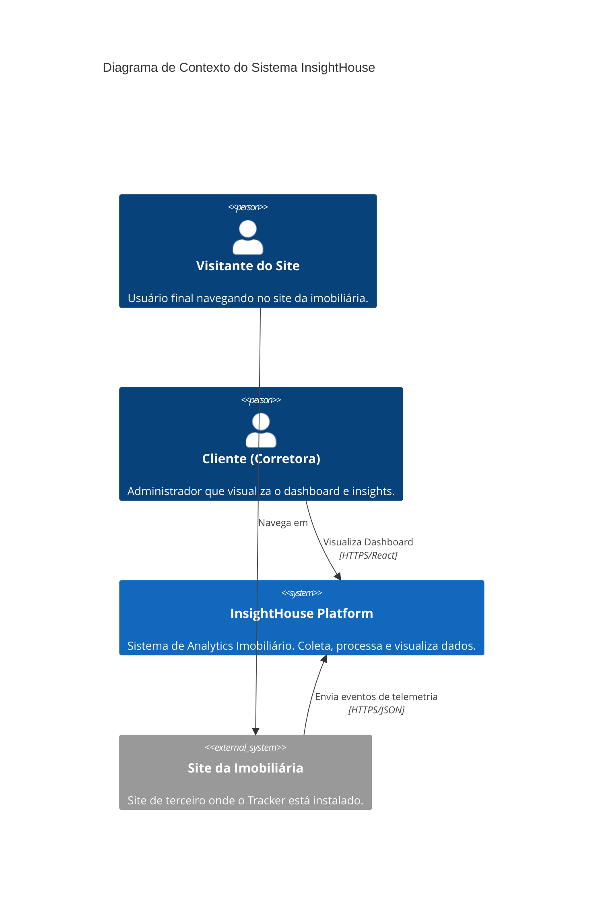
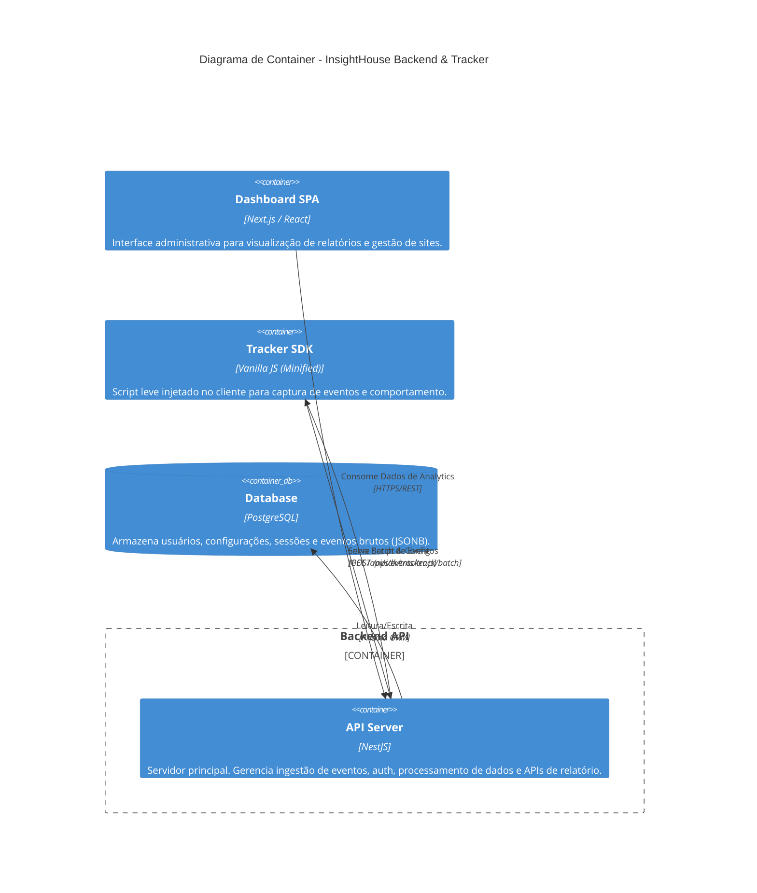
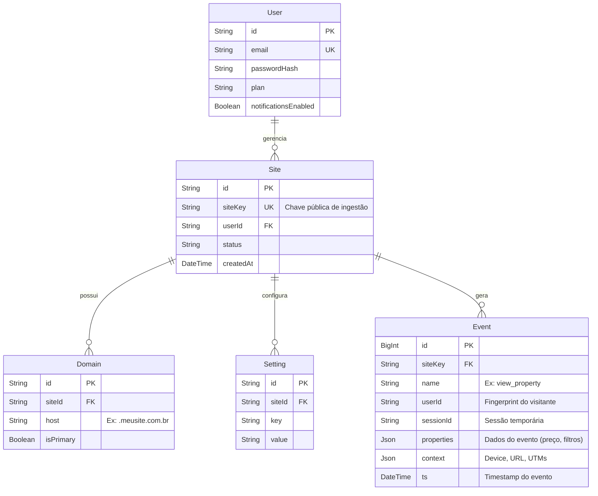

# Documentação de Arquitetura de Software (InsightHouse)

Este documento descreve a arquitetura técnica de alto nível do sistema InsightHouse. Destina-se a fornecer uma visão estrutural para fins acadêmicos (TCC) e de engenharia.

## 1. Modelo de Arquitetura (C4 Model)

O sistema segue uma arquitetura baseada em **Microsserviços Modulares** (Modular Monolith) com separação clara entre front-end, coleta de dados e ingestão.

### 1.1 Diagrama de Contexto (Nível 1)
Visão geral de como o sistema interage com usuários e sistemas externos.

### 1.2 Diagrama de Container (Nível 2)
Detalhamento dos containers técnicos e fronteiras de processo.

---

## 2. Modelagem de Dados (Entity Relationship Schema)

O banco de dados utiliza **PostgreSQL**. A modelagem combina estrutura relacional rígida para entidades de gerenciamento (Usuários, Sites) com estrutura flexível (NoSQL/JSONB) para dados de eventos de alta variabilidade.

### 2.1 Diagrama Entidade-Relacionamento (DER)

### 2.2 Decisões de Modelagem (Destaque Acadêmico)

1.  **Modelo Híbrido (Relacional + JSONB)**:
    *   A tabela `Event` usa um campo `properties` do tipo `JSONB`.
    *   **Justificativa**: Permite capturar eventos heterogêneos (ex: um evento de "Busca" tem filtros complexos, enquanto um "Clique no WhatsApp" tem apenas destino) sem criar centenas de colunas esparsas ou tabelas EAV (Entity-Attribute-Value) complexas. O PostgreSQL permite indexação eficiente dentro do JSONB, mantendo a performance de analytics.

2.  **Particionamento Lógico por `siteKey`**:
    *   Todos os eventos são isolados pelo `siteKey`, permitindo que o backend sirva múltiplos clientes (Multi-tenancy) na mesma infraestrutura, garantindo isolamento de dados na camada de aplicação.

---

## 3. Fluxo de Dados e Segurança

### 3.1 Fluxo de Ingestão de Dados (Pipeline)

1.  **Captura**: O `tracker.js` intercepta interações no DOM (cliques, formulários).
2.  **Buffer**: Eventos são acumulados em memória no navegador (fila).
3.  **Transmissão**: O envio ocorre em lote (Batch) a cada 3 segundos ou 10 eventos, usando `navigator.sendBeacon` ou `fetch` com `keepalive` para garantir entrega mesmo se a aba fechar.
4.  **Validação (Guard)**: O Backend valida o `X-Site-Key` e a origem (`Origin` header) contra a tabela `Domain`.
5.  **Persistência**: O evento é gravado de forma assíncrona no banco de dados.

### 3.2 Processamento de Insights (On-Demand)

Diferente de sistemas que pré-calculam tudo (ETL), o InsightHouse utiliza uma abordagem **Query-Driven** para flexibilidade em tempo real.

*   Quando o cliente solicita um relatório (ex: "Conversão por Cidade nos últimos 7 dias"), o backend:
    1.  Recebe o range de datas.
    2.  Executa agregações SQL complexas diretamente sobre os dados JSONB brutos.
    3.  Aplica regras de negócio (definidas em `business_rules.md`) para calcular KPIs como "Visitantes Únicos" e "Taxa de Conversão".
    4.  Retorna o JSON pronto para o gráfico.

---

## 4. Tecnologias Principais (Stack)

*   **Backend Runtime**: Node.js (V8 Engine)
*   **Framework**: NestJS (Arquitetura Modular, Injeção de Dependência)
*   **Database**: PostgreSQL
*   **ORM**: Prisma (Type-safe database access)
*   **Minification**: Terser (Compressão do Tracker SDK)
